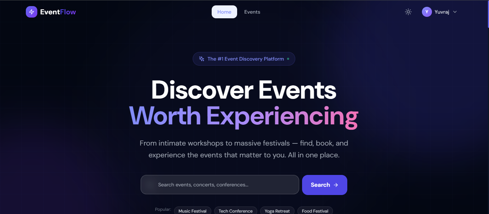
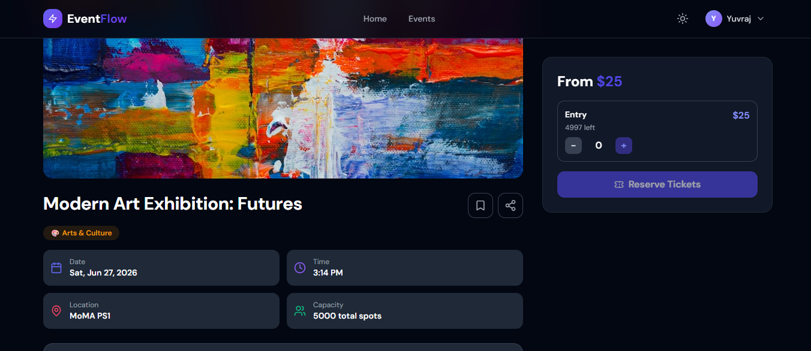
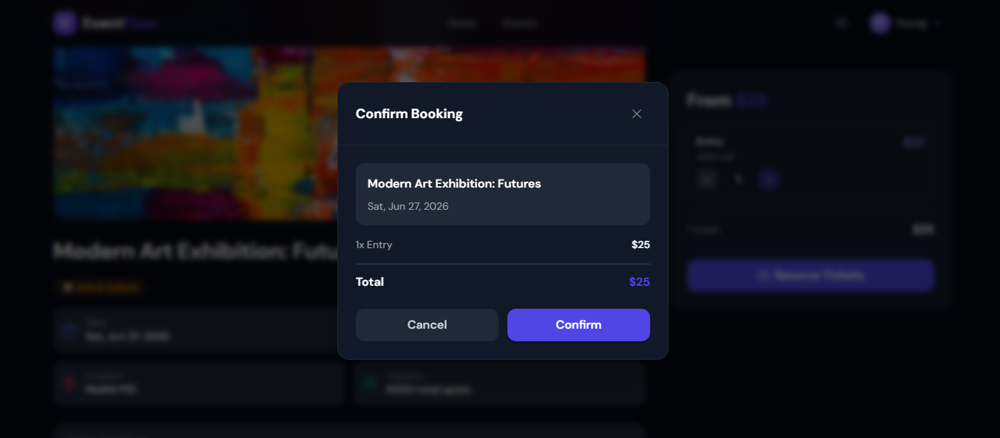
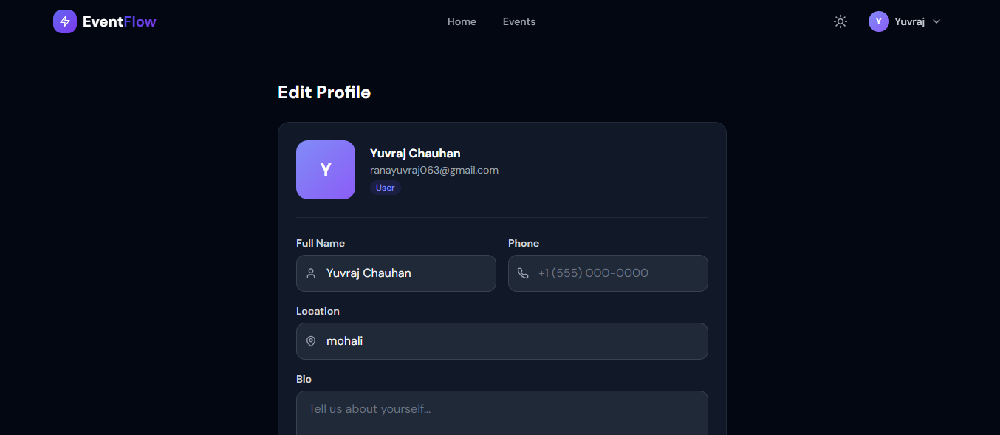
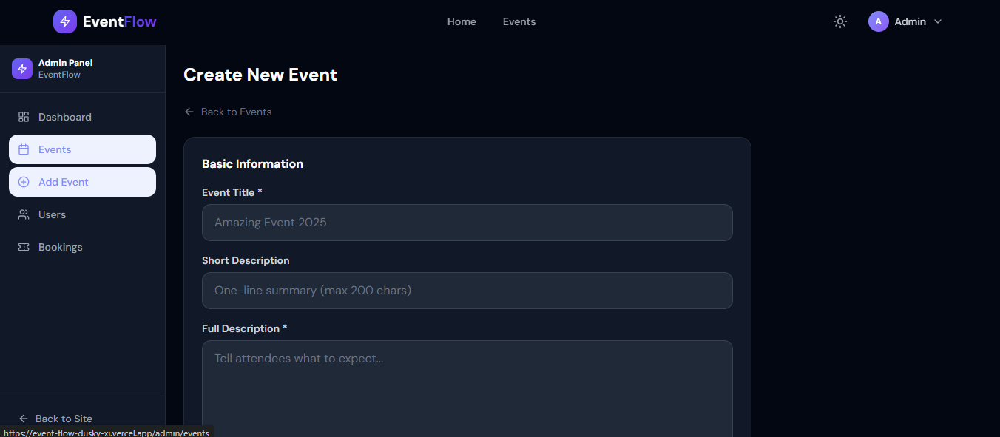

# ⚡ EventFlow — Full-Stack Event Organizer Platform

A production-ready full-stack event management platform built with the MERN stack (MongoDB, Express, React, Node.js).

EventFlow allows users to discover events, book tickets, receive QR-based confirmations, and manage bookings, while admins and organizers can create, manage, and analyze events through a powerful dashboard.

Perfect for portfolios, internships, and resume projects.

---

## 🌐 Live Demo

| Service | Link |
|---------|------|
| Frontend | https://event-flow-dusky-xi.vercel.app |
| Backend API | https://eventflow-he3o.onrender.com |
| API Health | https://eventflow-he3o.onrender.com/api/health |
| GitHub Repository | https://github.com/Yuvraj4v/EventFlow |

---

## 🧪 Demo Accounts

| Role | Email | Password |
|------|-------|----------|
| Admin | admin@eventflow.com | Admin@123456 |
| Organizer | organizer@eventflow.com | Password123 |
| User | user@eventflow.com | Password123 |

---

# 🚀 Tech Stack

### Frontend
- React 18
- Vite
- Tailwind CSS
- Zustand
- React Hook Form
- Framer Motion
- Recharts
- Axios

### Backend
- Node.js
- Express.js
- MongoDB
- Mongoose
- JWT Authentication
- bcrypt
- Nodemailer
- Stripe API

### Deployment
- Vercel (Frontend)
- Render (Backend)
- MongoDB Atlas (Database)

---

# ✨ Features

## User Features
- User Authentication (Register/Login/Forgot Password)
- Browse and Search Events
- Filter by Category, City, Date, Price
- Ticket Booking System
- QR Code Ticket Generation
- Booking Confirmation via Email
- Save/Favorite Events
- Booking History
- User Profile Management
- Dark/Light Mode
- Live Countdown Timer

---

## Admin Features
- Admin Dashboard Analytics
- Event CRUD Operations
- Manage Featured Events
- Manage Event Status
- User Management
- Booking Management

---

## Organizer Features
- Create and Manage Events
- View Event Bookings
- Update Event Status

---

## Technical Features
- Role-Based Authentication
- Protected Routes
- Rate Limiting
- Helmet Security
- Pagination
- Search Indexing
- Stripe Payment Flow
- Email Notifications
- QR Code Generation

---

# 📁 Project Structure

```bash
EventFlow/
│── backend/
│   ├── controllers/
│   ├── middleware/
│   ├── models/
│   ├── routes/
│   ├── utils/
│   ├── server.js
│   └── package.json
│
│── frontend/
│   ├── src/
│   │   ├── components/
│   │   ├── pages/
│   │   ├── services/
│   │   ├── store/
│   │   ├── App.jsx
│   │   └── main.jsx
│   ├── package.json
│   └── vite.config.js
```

---

# ⚙️ Installation Guide

## 1. Clone Repository

```bash
git clone https://github.com/Yuvraj4v/EventFlow.git
cd EventFlow
```

---

## 2. Backend Setup

```bash
cd backend
npm install
```

Create `.env` file:

```env
PORT=5000
NODE_ENV=development

MONGO_URI=your_mongodb_connection_string

JWT_SECRET=your_secret_key
JWT_EXPIRE=30d

FRONTEND_URL=http://localhost:5173

EMAIL_HOST=smtp.gmail.com
EMAIL_PORT=587
EMAIL_USER=your_email@gmail.com
EMAIL_PASS=your_app_password

STRIPE_SECRET_KEY=your_stripe_secret_key
```

Run backend:

```bash
npm run dev
```

---

## 3. Frontend Setup

```bash
cd frontend
npm install
```

Create `.env` file:

```env
VITE_API_URL=http://localhost:5000/api
VITE_STRIPE_PUBLISHABLE_KEY=your_publishable_key
```

Run frontend:

```bash
npm run dev
```

---

# 🌍 Deployment

## Backend (Render)
- Push backend to GitHub
- Create Web Service on Render
- Add environment variables
- Deploy

---

## Frontend (Vercel)
- Import repository
- Set root directory to frontend
- Add environment variables
- Deploy

---

## Database (MongoDB Atlas)
- Create cluster
- Add database user
- Allow IP access
- Use connection string in `.env`

---

# 🛠 API Endpoints

## Authentication
```http
POST /api/auth/register
POST /api/auth/login
GET /api/auth/me
POST /api/auth/forgot-password
PUT /api/auth/reset-password/:token
```

---

## Events
```http
GET /api/events
GET /api/events/:id
POST /api/events
PUT /api/events/:id
DELETE /api/events/:id
```

---

## Bookings
```http
POST /api/bookings
GET /api/bookings/my
GET /api/bookings/:id
PUT /api/bookings/:id/cancel
```

---

## Admin
```http
GET /api/admin/stats
GET /api/admin/users
PATCH /api/admin/users/:id/role
PATCH /api/admin/events/:id/status
```

---

# 🐛 Troubleshooting

| Problem | Solution |
|---------|----------|
| MongoDB Connection Error | Check MONGO_URI |
| CORS Error | Update FRONTEND_URL |
| Modules Missing | Run npm install |
| Email Not Sending | Use App Password |
| QR Not Showing | Import QRCodeSVG properly |

---

# 📸 Screenshots

## Homepage


---

## Event Details Page


---

## Booking Flow


---

## User Profile


---

## Admin Dashboard


---

# 🤝 Contributing

1. Fork the repository  
2. Create your branch

```bash
git checkout -b feature-name
```

3. Commit changes

```bash
git commit -m "Added new feature"
```

4. Push changes

```bash
git push origin feature-name
```

5. Open Pull Request

---

# 📄 License

This project is licensed under the MIT License.

---

# 👨‍💻 Author

**Yuvraj Chauhan**

GitHub: https://github.com/Yuvraj4v

LinkedIn: https://www.linkedin.com/in/yuvraj-chauhan-b248l

---

⭐ If you like this project, give it a star on GitHub.